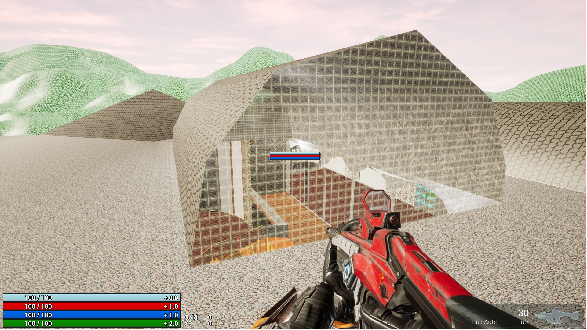

# Networked Shooter

## Introduction

This game was one that I found as I was exploring Unreal Engine 4, and a plugin called the Gameplay Ability System or GAS. This is a highly flexible framework for building the types of abilities and attributes that you might find in an RPG or MOBA title. You can build actions or passive abilities for the characters in your games to use, and status effects that can build up or wear down various attributes as a result of these actions, additionally you can implement "cooldown" timers or resource costs to regulate the usage of these actions, change the level of the ability and its effects at each level, activate particle, sound effects, and more. The Gameplay Ability System can help you to design, implement, and efficiently network in-game abilities from as simple as jumping to as complex as your favorite character's ability set in any modern RPG or MOBA title. 

## Client and Server

For this game, I've created a simple Mansion I found on Sketchup 3dWarehouse. I took the file from there, exported it to FBX, then imported it into Unreal Engine 5 with Nanite turned on. Here's the link for the Map I used. <a href="https://3dwarehouse.sketchup.com/model/u1cb07898-79da-4994-abb2-4497b6624ca2/Two-Story-mansion">Two Story Mansion</a>

I also used the GASShooter Textures and Models as well as boilerplate code to get things going. I only had to make minor changes, for my needs. The build goals of this project include a client/server model, which I got working. With the development version of the build, one could build the server and the client, provided they have UE5 Built from source properly for client and server, then one could host their own games. I've included some binaries of the project. I was not able to get the shipping version of the Server to build, so I've left that out of the binaries, because I have my server running local. If you have troubles with the build, or would like access to the server executable, please feel free to contact me. 

---

****
*     Original GASShooter Readme Below:
****

---

# (ORIGINAL) GASShooter

## Introduction

GASShooter is an advanced FPS/TPS Sample Project for Unreal Engine 5's GameplayAbilitySystem (GAS) plugin. This is a sister project to the [GASDocumentation](https://github.com/tranek/GASDocumentation) and information about the techniques demonstrated here will be discussed in detail in the README there.

This is not production-ready code but a starting point for evaluating different techniques in GAS relating to using weapons. TargetActors with persistent hit results and ReticleActors particularly do a lot of code on `Tick()`.

Assets included come from Epic Games' ShooterGame learning project, Epic Games' Infinity Blade assets, or made by myself.

GASShooter is current with **Unreal Engine 5.0**. There are branches of this Sample Project for older versions of Unreal Engine, but they are no longer supported and are liable to have bugs or out of date information.

| Keybind             | Action                                                      |
| ------------------- | ----------------------------------------------------------- |
| T                   | Toggles between first and third person.                     |
| Left Mouse Button   | Activates the weapon's primary ability. Confirms targeting. |
| Middle Mouse Button | Activates the weapon's alternate ability.                   |
| Right Mouse Button  | Activates the weapon's secondary ability.                   |
| Mouse Wheel Up      | Swaps to next weapon in inventory.                          |
| Mouse Wheel Down    | Swaps to previous weapon in inventory.                      |
| R                   | Reloads the weapon.                                         |
| Left Ctrl           | Cancels targeting.                                          |
| Left Shift          | Sprint.                                                     |
| E                   | Interact with interactable objects.                         |

| Console Command | Action                  |
| --------------- | ----------------------- |
| `kill`          | Kills the local player. |

The Hero character does have mana but no abilities currently use it. This project's inception started when the new BioShock was announced and the idea was to include BioShock-like upgradeable abilities. That made the scope too large, but it is something that may be revisited in the future.

Secondary ammo is not used. It would be used for things like rifle grenades.

## Concepts covered

* [Ability Batching](https://github.com/tranek/GASDocumentation#concepts-ga-batching)
* Equippable weapons that grant abilities
* Predicting weapon switching
* [Weapon ammo](https://github.com/tranek/GASDocumentation#concepts-as-design-itemattributes)
* Simple weapon inventory
* Headshot bonus damage
* [Reusable, custom TargetActors](https://github.com/tranek/GASDocumentation#concepts-targeting-actors)
* [GameplayAbilityWorldReticles](https://github.com/tranek/GASDocumentation#concepts-targeting-reticles)
* Play replicated montages on multiple Skeletal Mesh Components **belonging to the AvatarActor** in an ability
* [Subclassing `FGameplayEffectContext`](https://github.com/tranek/GASDocumentation#concepts-ge-context) to send additional information to GameplayCues
* Character shield that drains before health is removed by damage
* Item pickups
* Single button interaction system. Press or Hold 'E' to interact with interactable objects including player reviving, a weapon chest, and a sliding door.

This project does not show predicting projectiles. I refer you to the Unreal Tournament source code for how to do that using a fake projectile on the owning client.

| Weapon          | Primary Ability (Left Mouse Button)                  | Secondary Ability (Right Mouse Button)                                                                     | Alternate Ability (Middle Mouse Button)                     |
| --------------- | ---------------------------------------------------- | ---------------------------------------------------------------------------------------------------------- | ----------------------------------------------------------- |
| Rifle           | Fire hitscan bullets based on the current fire mode. | Aim down sights, reduces firing spread.                                                                    | Changes fire modes between full auto, semi auto, and burst. |
| Rocket Launcher | Fire a rocket.                                       | Aim down sights. Starts lock-on targeting for homing rockets. Press LMB to fire homing rockets at targets. | None                                                        |
| Shotgun         | Fire hitscan pellets based on the current fire mode. | Aim down sights, reduces firing spread for pellets.                                                        | Changes fire modes between semi auto and full auto.         |

## Acknowledgements

[KaosSpectrum](https://github.com/KaosSpectrum) provided significant contributions to figuring out how the ability batching system works and general feedback. Check out his game development [blog](https://www.thegames.dev/).
